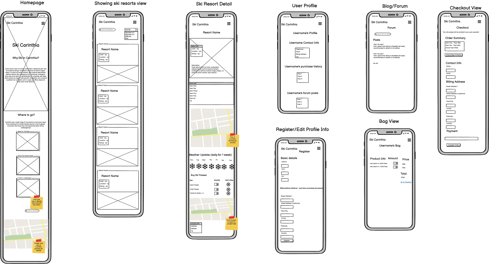
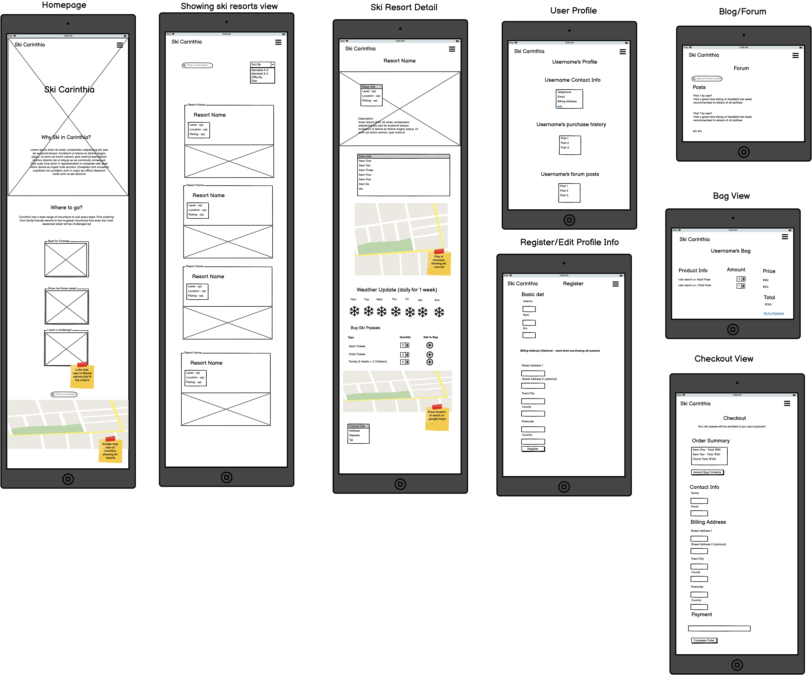

# Ski Carinthia

## About

This is my fourth and final Milestone Project for the Full Stack Software Development Diploma with Code Institute. This project requires all elements of software development I have learned so far. It uses HTML, CSS and JavaScript for the front end and makes use of Python and the Django framework for the backend, which also uses the PostgreSQL relational database system.

This project is a website for skiers visiting Carinthia, Austria. It allows visitors to view ski areas/resorts/mountains, purchase tickets using the Stripe Authentication software as well as contribute to a form/blog on the website.

## UXD

### Strategy

I want any user to instantly recognise the purpose of the site, and to feel at ease every step of the way. There is no specific user base this website caters to, just the general public. To that end, the user stories below are non specific in terms of demographic, and only differentiate insofar as whether a user is a first time visitor, a general visitor, a logged in user or a shopper.

#### User Stories

User Story ID | As a user | I want to be able to | So that I can | Fulfilled
--------------|-----------|----------------------|---------------|--------------
1|first time visitor|recognise the purpose of the site immediately|identify whether I am interested in the content and wish to use the site|[Complete](#home-page) :heavy_check_mark:
2|general visitor|easily navigate the site on any device|easily use and navigate the site|[Complete](#navigation-and-responsiveness)
3|general visitor|view a list of ski resorts|find which resort I would like to visit|[Complete](#resorts-page) :heavy_check_mark:
4|general visitor|view individual ski resort details|identify which resort is best for my purposes|[Complete](#resort-detail) :heavy_check_mark:
5|general visitor|view weather for ski resorts|identify which resort has the best conditions on a particular day|[Complete](#resort-detail) :heavy_check_mark:
6|general visitor|easily register an account|make purchases/contribute to blog|[Complete](#register) :heavy_check_mark:
7|logged in user|easily login/out|access my personal account|[Complete](#sign-in) :heavy_check_mark:
8|logged in user|reset password|access my personal account if I have forgotten my password|[Complete](#sign-in) :heavy_check_mark:
9|logged in user|have personal profile|view/update personal details and access ski pass|[Complete](#profile-page) :heavy_check_mark:
10|shopper|add items to shopping bag|prepare items for purchase |[Complete](#resort-detail) :heavy_check_mark:
11|shopper|see total of shopping bag|identify how much I will pay|[Complete](#bag-page) :heavy_check_mark:
12|shopper|modify shopping bag contents|make changes to bag if needed|[Complete](#bag-page) :heavy_check_mark:
13|shopper|checkout using credit/debit card|purchase ski passes|[Complete](#checkout-page) :heavy_check_mark:
14|shopper|be notified if my card info is invalid and why|make necessary changes to card info|[Complete](#checkout-page) :heavy_check_mark:
15|shopper|be notified if a purchase is successful|be sure that my purchase was successful|[Complete](#checkout-success) :heavy_check_mark:
16|shopper|view order details|review my purchase|[Complete](#checkout-success) :heavy_check_mark:
17|shopper|receive email confirmation of order|keep formal confirmation of my successful purchase|[Complete](#checkout-success) :heavy_check_mark:
18|general visitor|view blogs|see blogs to get an idea of people's experiences|[Complete](#blog-detail) :heavy_check_mark:
19|logged in user|add blog post|add personal post to website|[Complete](#add-blog-post) :heavy_check_mark:
20|general visitor|search for ski resort by name|find a particular resort|[Complete](#resorts-page) :heavy_check_mark:
21|general visitor|use a map to see ski resort locations|find resort well located for me|[Complete](#home-page) :heavy_check_mark:
22|general visitor|sort ski resorts|find resort suitable for me|[Complete](#resorts-page) :heavy_check_mark:
23|admin/superuser|admin power to edit/delete blog posts entered by users|amend irrelevant or inappropriate content|[Complete](#blog-detail) :heavy_check_mark:
24|admin/superuser|have crud power over all ski resorts|amend information if necessary|[Complete](#admin) :heavy_check_mark:

### Structure

The site has a simple layout, heavily influenced by the Bootstrap framework.

The navbar always sits at the top of each page, taking the user to all the site sections they can access. Only the pages relevant to the user are displayed e.g. a logged in user will not see a link to the 'login' page as they are logged in. Equally a logged out user will not see a link to the 'logout' page as they are alerady logged out. If a user tries to manually enter an invalid page url, they will be redirected automatically to the homepage. There is also a search bar on the navbar, prompting a user to search for a 'mountain' or resort.

As an example, I will outline a few features as included in the home page that are beneficial to the general user experrience below. I will expand on the rest of the website in further detail in the 'Features' section of this readme.

The home page features call to action buttons for a user to immediately either view resorts or to view the blogs. There is also a button with a downward arrow at the bottom of the image which indicates to a user they can continue scrolling. The rest of the homepage contains links to filtered results of the resorts page. These are commonly desired ski resort 'types' such as family friendly resorts, or large, expansive resorts for example. The final section of the home page shows a map, displaying all of the resorts as tacks. Clicking on each tack opens up a tooltip with extra information to the resort and a link to the relevant detailed page.

Links and interactive elements are clearly signposted. Buttons have a colour scheme where 'positive' feedback buttons have green text, 'neutral' buttons have blue text and 'negative' buttons have red text. This is in line with the Bootstrap colour library (success, info and danger) but with the colours amended to suit the colour scheme for this project.

### Skeleton

Below are the wireframes created in advance of starting the project. I used the wireframing software [Balsamiq](https://balsamiq.com/) for this project.

* Mobile Wireframe
  

* Tablet Wireframe
  

* Desktop Wireframe
  

The wireframes were useful when constructing the site, but as can be seen on some pages, I deviated from the original design in some aspects. This was to be expected, as the wireframes only gave me a rough idea of what I wanted. For example, on the desktop version of the ski resort detail, the layout is significantly different in the final product. The wirefraem was still very useful when creating the page however, as it gave me a firm outline of all the most important features needed.

### Surface

I picked a very simple palette for this project. The standout scheme is a blue navbar, with an off-white main section below. This is to imitate a mountain scene with a blue sky and a white snow covered mountain below.

* #3F68B8 'True Blue' - used for navbar, card, input borders, 'neutral' buttons
* #F4F4F9 'Ghost White' - main background colour
* #343A40 'Gunmetal' - main text colour
* #008100 'Ao English' - used for 'positive' buttons
* #F95738 'Orange Soda' - used for 'negative' buttons

There were a few images and icons used for the project, all within the 'skiing' theme. 

## Database Model

This project uses the PostgreSQL relational database. There is a total of 6 models.

### **Models**

#### **Resorts**

This model concerns all resorts.

---
Name              |Field Type  |Validation                                             
------------------|------------|-------------------------------------------------------
name              |CharField   |max\_length=36                                         
description       |TextField   |null=True, blank=True                                  
extra\_info       |TextField   |null=True, blank=True                                  
size              |CharField   |max\_length=6                                          
street\_address\_1|CharField   |max\_length=80, null=False, blank=False                
street\_address\_2|CharField   |max\_length=80, null=False, blank=False                
postcode          |CharField   |max\_length=20, null=True, blank=True                  
town\_or\_city    |CharField   |max\_length=20, null=True, blank=True                  
phone\_number     |CharField   |max\_length=20, null=True, blank=True                  
website           |URLField    |null=True, blank=True                                  
email             |EmailField  |null=True, blank=True                                  
scenic            |BooleanField|default=false, null=True, blank=True                   
family\_friendly  |BooleanField|default=false, null=True, blank=True                   
adult\_price      |DecimalField|max\_digits=6, decimal\_places=2, null=True, blank=True
child\_price      |DecimalField|max\_digits=6, decimal\_places=2, null=True, blank=True
family\_price     |DecimalField|max\_digits=6, decimal\_places=2, null=True, blank=True
x\_map\_reference |DecimalField|max\_digits=6, decimal\_places=4, null=True, blank=True
y\_map\_reference |DecimalField|max\_digits=6, decimal\_places=4, null=True, blank=True
image             |ImageField  |null=True, blank=True                                  
image\_credit     |CharField   |max\_length=64, null=False, blank=False                
map\_image        |ImageField  |null=True, blank=True                                  

#### **UserProfile**

This model concerns the user profile as created by the user.

---

Name                     |Field Type   |Validation                                   
-------------------------|-------------|---------------------------------------------
user                     |OneToOneField|User, on\_delete=models.CASCADE              
default\_phone\_number   |CharField    |max\_length=20, null=True, blank=True        
default\_street\_address1|CharField    |max\_length=80, null=True, blank=True        
default\_street\_address2|CharField    |max\_length=80, null=True, blank=True        
default\_postcode        |CharField    |max\_length=20, null=True, blank=True        
default\_town\_or\_city  |CharField    |max\_length=40, null=True, blank=True        
county                   |CharField    |max\_length=80, null=True, blank=True        
country                  |CountryField |blank\_label='Country', null=True, blank=True

#### **Order**

This model concerns all orders. It is populated when a user reaches the checkout.

---

Name            |Field Type   |Validation                                                                            
----------------|-------------|--------------------------------------------------------------------------------------
order\_number   |CharField    |max\_length=32, null=False, editable=False                                            
user\_profile   |ForeignKey   |userprofile, on\_delete=models.SET\_NUL, null=True, blank=True, related\_name='orders'
full\_name      |CharField    |max\_length=50, null=True, blank=True                                                 
email           |CharField    |max\_length=254, null=True, blank=True                                                
phone\_number   |CharField    |max\_length=20, null=False, blank=False                                               
country         |CountryField |blank\_label='Country \*', null=True, blank=True                                      
postcode        |CharField    |max\_length=20, null=False, blank=False                                               
town\_or\_city  |CharField    |max\_length=40, null=True, blank=True                                                 
street\_address1|CharField    |max\_length=80, null=False, blank=False                                               
street\_address2|CharField    |max\_length=80, null=True, blank=True                                                 
county          |CharField    |max\_length=80, null=True, blank=True                                                 
date            |DateTimeField|auto\_now\_add=True                                                                   
order\_total    |DecimalField |max\_digits=10, decimal\_places=2, null=False, default=0                              
original\_bag   |TextField    |null=False, blank=False, default=''                                                   
stripe\_pid     |CharField    |max\_length=254, null=False, blank=False, default=' '                                 

#### **OrderLineItem**

This model concerns each item as entered into the shopping bag. This is also populated at the checkout.

---

Name           |Field Type  |Validation                                                                          
---------------|------------|------------------------------------------------------------------------------------
order          |ForeignKey  |order, null=False, blank=False, on\_delete=models.CASCADE, related\_name='lineitems'
resort         |ForeignKey  |Resort, null=False, blank=False, on\_delete=models.CASCADE                          
ticket\_type   |CharField   |max\_length=12, null=False, blank=False                                             
ticket\_price  |DecimalField|max\_digits=6, decimal\_places=2, null=True, blank=True                             
quantity       |IntegerField|null=False, blank=False, default=0                                                  
lineitem\_total|DecimalField|max\_digits=6, decimal\_places=2, null=False, blank=False           

#### **Post**

This model concerns blog posts as created by users.

---

Name           |Field Type   |Validation                                                                            
---------------|-------------|--------------------------------------------------------------------------------------
user\_profile  |ForeignKey   |userprofile, on\_delete=models.SET\_NULL, null=True, blank=True, related\_name='blogs'
title          |CharField    |max\_length=200                                                                       
content        |TextField    |                                                                                      
created\_date  |DateTimeField|auto\_now\_add=True                                                                   
published\_date|DateTimeField|blank=True, null=True, default=timezone.now                                           
views          |IntegerField |default=0                                                                             
tag            |charfield    |max\_length=30, blank=True, null=True                                                 

#### **PostComment**

This model concerns comments on blog posts as created by users.

---

author         |ForeignKey   |userprofile, on\_delete=models.SET\_NULL, null=True, blank=True
---------------|-------------|---------------------------------------------------------------
post           |ForeignKey   |Post, on\_delete=models.CASCADE, related\_name='comments       
content        |TextField    |                                                               
published\_date|DateTimeField|blank=True, null=True, default=timezone.now                    
points         |IntegerField |default=0                                                      

### **Database Schema**

The relationship between the models can be seen in the ER diagram below, created using [lucidchart.com](https://www.lucidchart.com/)

## Features

I will list and briefly outline the main features of the site page by page below. I will also use the user stories as defined [here](#user-stories) as points of reference.

### Home Page

Upon entering the home page of the website, the user sees a large hero image, which displays a ski slope. The user is also prompted to 'Discover all Resorts' or to 'Check out our Blogs' as call to action buttons. There is also a 'down arrow' button towards the bottom which prompts a user to either scroll down or select the button to be taken to the next section of the page.

This fulfills user story 1 :heavy_check_mark:

Scrolling down/selecting the 'down arrow' button takes the user to the 'Where to Go?' section of the page. The page features a brief text with info for the user and links to 3 common/popular types of resort (Family, Spectacular Views, Large Resort).

The final part of the home page shows the user a map of all of Carinthia. Map markers are placed on each resort, with extra info and a link to each resort displayed on a tooltip that appears when selecting a marker.

This fulfills user story 21 :heavy_check_mark:

### Resorts Page

The resorts page of the website displays a list of all of the resorts. A user can search for a resort by name, description term, extra info or town. This is probably most useful for a user to search for a specific resort or town that they are to some extent familiar with. For a first time user, it is perhaps more useful to be able to filter or sort the results to find the most suitable resort.

The function of this page fulfills user story 3 :heavy_check_mark:

The search bar fulfills user story 20 :heavy_check_mark:

The sort and filter options fulfull user story 22 :heavy_check_mark:

* Resorts filters detail

The list of resorts is displayed as a paginated list, with at most 8 resorts being displayed on the page at once. This is to reduce scrolling, especially on smaller devices and lends a more pleasant user experience. The total number of results is displayed along with the current page.

Each resort is listed in a 'card' format, showing an image of the resort followed by the name and a short description. Selecting the card will take the user to a more detailed view of the resort which I shall describe in the next section.

### Resort Detail

The resort detail page contains all the info a user needs about a resort, as well as allowing them to add ski passes to their shopping bag.

The general function of the page fulfills user story 4 :heavy_check_mark:

A large hero image of the resort is displayed at the top of the page, followed by the description and some extra information, generally pertaining to the size of resort and number of lifts. Hovering over the image with the mouse displays the image credit in the bottom right corner.

Below this, an image of the ski map for the resort is shown. A user can select this to enlarge the image for a more detailed view.

* Ski map unenlarged

* Ski map enlarged

The next section allows a user to add ski passes to their shopping bag. There are three types of ticket available for each resort - adult, child and family passes. All of these vary in price and are 'valid for any date'. A future feature that could be implemented is for a user to buy tickets for a specific date as well.

This function fulfills user story 10 :heavy_check_mark:

Below, the 5 day weather forecast is shown for the resort. This is useful if a user is in the area and wishes to see the conditions for the upcoming days. Information displayed is the dates, temperature ranges, a weather description and the level of snow, which is especially important for a skiing resort. At the time of writing it is mid summer, so the displayed snow units are at 0cm, however during skiing season these numbers will 'hopefully' be higher.

This fulfills user story 5 :heavy_check_mark:

The final section of this page shows the user the address and contact details for the resort. A map is also displayed with the resort location shown.

### Blog

The structure of the blog page is similar to the resorts page. There is a search bar at the top, with a sort selector underneath. Users can search for a blog by title, author or tag. Sorting can be done in several ways, the default option is most recent first.

Just like in the resorts page, each blog is shown in card form. The list is paginated with maximum 8 blogs shown per page. There are buttons which appear on the card, which differ depending on who is using the website. An anonymous user will only see the 'read more' button, while the author of a post will have buttons providing options to either delete or edit that post. A superuser account will see the delete and edit buttons for all posts. The screenshot below demonstrates the appearance for the 'admin' superuser account. As can be seen, the post was published by user 'Patrick', but the superuser has full CRUD functionality.

### Add Blog Post

If a user selects the 'add blog post' button from the blog page, they are taken to the 'new blog' page. This button and page is only accessible for authenticated users. The page contains a simple form, allowing a user to add a short blog post. The title and content fields are mandatory. The database automatically stores the current time and the authenticated user (author) upon form submission.

This page fulfills user story 19 :heavy_check_mark:

### Blog Detail

As with resort detail pages, any user can access the blog detail page for any existing blog post. Once again, the author or superuser can access the edit/delete options from this page. The page shows the full blog content, date of publication, post views and tags.

This page fulfills user story 18 :heavy_check_mark:
Superuser has full admin control, which fulfills user story 23, this can also be done from the Django admin page :heavy_check_mark:

I added an extra feature to this page that hadn't been originally planned, which was the comments section. Each blog has a comment section where an authenticated user can leave their feedback on a blog. Any user can see blog comments, but only authenticated users can post them. The author of a comment or the superuser has the authority to delete a comment. On top of this, any authenticated user can either 'upvote' or 'downvote' a comment, similar to online forums like Reddit. However, a user is able to up or down-vote a comment as many times as they like - a useful future feature would be to allow a user to only leave one vote per comment. Comments can be sorted, the default option is newest first.

### Bag Page

The shopping bag page displays the current contents of the user's shopping bag as well as the total cost. A user can change item quantities as well as delete items from the bag from this page. Any user can add items to the shopping bag to make purchases.

This page fulfills user stories 11 and 12 :heavy_check_mark:

### Checkout Page

The checkout page follows a simple layout. The user is displayed their order contents and full price. They then need to fill in their personal and billing details for the order, including card details. The project uses [Stripe](https://stripe.com/gb) for payment authentication. The project currently only uses test stripe api keys, which means that the card data must be one of the preset Stripe test card details. During testing I have used the basic 4242 4242 4242 4242 test card number.

The function of this page fulfills user story 13 :heavy_check_mark

If a user enters an invalid card number, the page displays the standard Stripe error messages below the card input.

This fulfills user story 14 :heavy_check_mark:

### Checkout Success

Once an order is successfully completed, the user is redirected to the checkout success page. The page shows the full order details for the customer as well as a QR code at the bottom of the page which the user 'can redeem' to get their ski passes at the counter. In fact, the QR code simply redirects to the same page as this is not an official website.

This fulfills user stories 15 and 16 :heavy_check_mark:

The user also receives email confirmation of the purchase along with a link to return to the checkout-success page.

This fulfills user story 17 :heavy_check_mark:

### Register

A user can register from the 'register' page. All user registration/login etc is handled by the 'django-allauth' module.

This fulfills user story 6 :heavy_check_mark:

The layout is simple. The inputs prompt the user to enter and confirm their email address, provide a username, and enter and confirm a password.

If a user enters invalid data (i.e. username already taken/passwords do not match etc) then the form will not submit and the errors will be displayed in the relevant location on screen.

### Sign In

A registered user can sign in from the sign in page. A user can enter either their username or email along with the password.

This page fulfills user story 7 :heavy_check_mark:

If a user has forgotten their password, they can reset it from this page by selecting the 'forgot password?' link. This takes the user to a page where they enter the email address linked to their account. They then receive a link by email to reset the password.

### Profile Page

An authenticated user can access their profile page. This page displays their address details, these are saved so that a user can more quickly checkout without having to enter their details each time. They can also access previous orders and blog posts from this page

This page fulfills user story 8 :heavy_check_mark:

### Admin

Django allows the superuser to access the admin page. From here, the superuser can change the resort details for any resort.

This fulfills user story 24 :heavy_check_mark:

### Navigation and Responsiveness

The site uses a simple Bootstrap responsive navbar. All sections of the site can be reached from here - the resorts, blog, bag sections for everyone. Profile + logout for an authenticated user, and register/sign in for an unauthenticated user. The navbar menu items can be found within the standard 'hamburger' menu icon on smaller devices.

If a user is authenticated, their username is displayed on the navbar on the link to their personal profile. If they have added items to their bag, the bag total is also displayed on the link to the bag page.

All pages are designed with a mobile first approach using the Bootstrap responsive flexbox grid. For example the cards on the index page are displayed horizontally inline on a large device as in the image below.

On smaller/narrower devices the cards are displayed vertically aligned.

These fulfil user story 2 :heavy_check_mark: