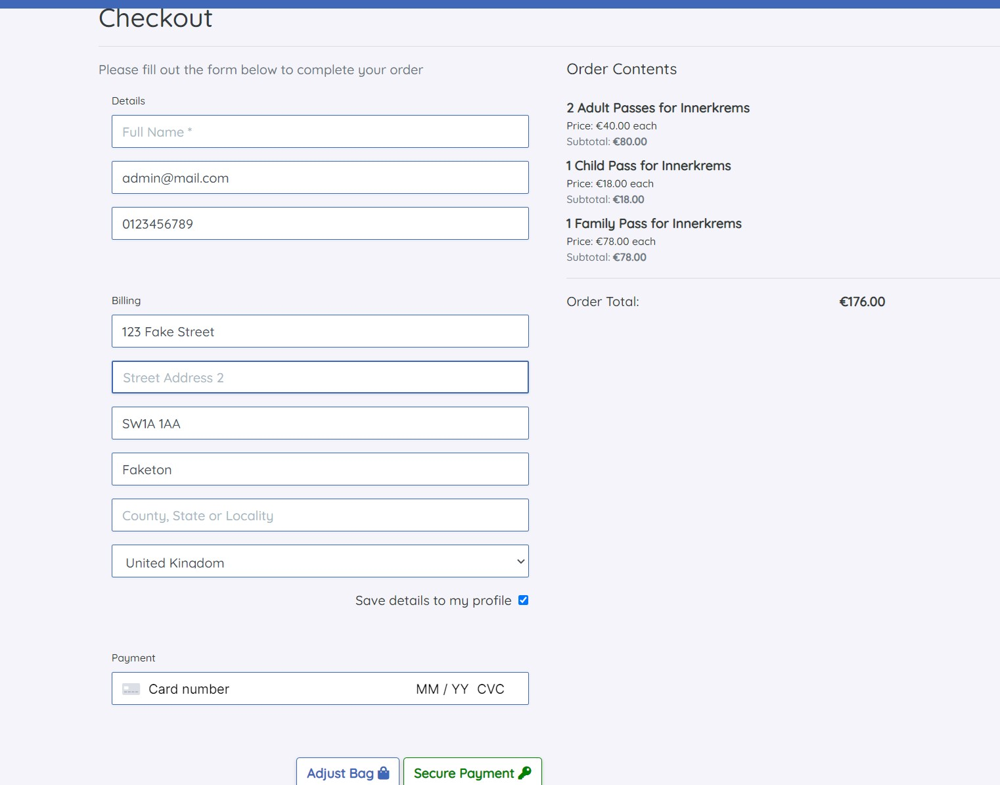
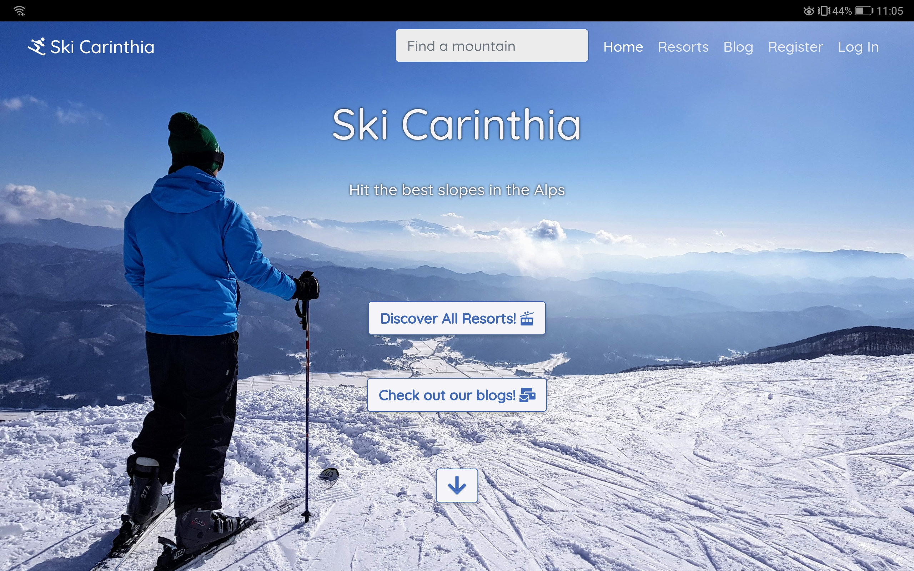

# Ski Carinthia

## About

This is my fourth and final Milestone Project for the Full Stack Software Development Diploma with Code Institute. This project requires all elements of software development I have learned so far. It uses HTML, CSS and JavaScript for the front end and makes use of Python and the Django framework for the backend, which also uses the PostgreSQL relational database system.

This project is a website for skiers visiting Carinthia, Austria. It allows visitors to view ski areas/resorts/mountains, purchase tickets using the Stripe Authentication software as well as contribute to a form/blog on the website. Users must be logged in and authenticated to make a purchase and view their orders.

## UXD

### Strategy

I want any user to instantly recognise the purpose of the site, and to feel at ease every step of the way. There is no specific user base this website caters to, just the general public. To that end, the user stories below are non-specific in terms of demographic and only differentiate insofar as whether a user is a first time visitor, a general visitor, a logged-in user or a shopper.

#### User Stories

User Story ID | As a user | I want to be able to | So that I can | Fulfilled
--------------|-----------|----------------------|---------------|--------------
1|first time visitor|recognise the purpose of the site immediately|identify whether I am interested in the content and wish to use the site|[Complete](#home-page) :heavy_check_mark:
2|general visitor|easily navigate the site on any device|easily use and navigate the site|[Complete](#navigation-and-responsiveness) :heavy_check_mark:
3|general visitor|view a list of ski resorts|find which resort I would like to visit|[Complete](#resorts-page) :heavy_check_mark:
4|general visitor|view individual ski resort details|identify which resort is best for my purposes|[Complete](#resort-detail) :heavy_check_mark:
5|general visitor|view weather for ski resorts|identify which resort has the best conditions on a particular day|[Complete](#resort-detail) :heavy_check_mark:
6|general visitor|easily register an account|make purchases/contribute to blog|[Complete](#register) :heavy_check_mark:
7|logged in user|easily login/out|access my personal account|[Complete](#sign-in) :heavy_check_mark:
8|logged in user|reset password|access my personal account if I have forgotten my password|[Complete](#sign-in) :heavy_check_mark:
9|logged in user|have personal profile|view/update personal details and access ski pass|[Complete](#profile-page) :heavy_check_mark:
10|shopper|add items to shopping bag|prepare items for purchase |[Complete](#resort-detail) :heavy_check_mark:
11|shopper|see total of shopping bag|identify how much I will pay|[Complete](#bag-page) :heavy_check_mark:
12|shopper|modify shopping bag contents|make changes to bag if needed|[Complete](#bag-page) :heavy_check_mark:
13|shopper|checkout using credit/debit card|purchase ski passes|[Complete](#checkout-page) :heavy_check_mark:
14|shopper|be notified if my card info is invalid and why|make necessary changes to card info|[Complete](#checkout-page) :heavy_check_mark:
15|shopper|be notified if a purchase is successful|be sure that my purchase was successful|[Complete](#checkout-success) :heavy_check_mark:
16|shopper|view order details|review my purchase|[Complete](#checkout-success) :heavy_check_mark:
17|shopper|receive email confirmation of order|keep formal confirmation of my successful purchase|[Complete](#checkout-success) :heavy_check_mark:
18|general visitor|view blogs|see blogs to get an idea of people's experiences|[Complete](#blog-detail) :heavy_check_mark:
19|logged in user|add blog post|add personal post to website|[Complete](#add-blog-post) :heavy_check_mark:
20|general visitor|search for ski resort by name|find a particular resort|[Complete](#resorts-page) :heavy_check_mark:
21|general visitor|use a map to see ski resort locations|find resort well located for me|[Complete](#home-page) :heavy_check_mark:
22|general visitor|sort ski resorts|find resort suitable for me|[Complete](#resorts-page) :heavy_check_mark:
23|admin/superuser|admin power to edit/delete blog posts entered by users|amend irrelevant or inappropriate content|[Complete](#blog-detail) :heavy_check_mark:
24|admin/superuser|have crud power over all ski resorts|amend information if necessary|[Complete](#admin) :heavy_check_mark:

### Structure

The site has a simple layout, heavily influenced by the Bootstrap framework.

The navbar always sits at the top of each page, taking the user to all the site sections they can access. Only the pages relevant to the user are displayed e.g. a logged-in user will not see a link to the 'login' page as they are logged in. Equally, a logged out user will not see a link to the 'logout' page as they are already logged out. If a user tries to manually enter an invalid page URL, they will be redirected automatically to the homepage. There is also a search bar on the navbar, prompting a user to search for a 'mountain' or resort.

Similarly, an unauthenticated user cannot access certain parts of the website such as the 'bag' and 'checkout' pages as only an authenticated user can make purchases.

If a user tries to access a 'forbidden' page, they will be either automatically redirected with an error message toast appearing or asked to log in/register as required.

As an example, I will outline a few features as included in the home page that are beneficial to the general user experience below. I will expand on the rest of the website in further detail in the 'Features' section of this readme.

The home page features call to action buttons for a user to immediately either view resorts or to view the blogs. There is also a button with a downward arrow at the bottom of the image which indicates to a user they can continue scrolling. The rest of the homepage contains links to filtered results of the resorts page. These are commonly desired ski resort 'types' such as family-friendly resorts, or large, expansive resorts for example. The final section of the home page shows a map, displaying all of the resorts as tacks. Clicking on each tack opens up a tooltip with extra information to the resort and a link to the relevant detailed page.

Links and interactive elements are signposted. Buttons have a colour scheme where 'positive' feedback buttons have green text, 'neutral' buttons have blue text and 'negative' buttons have red text. This is in line with the Bootstrap colour library (success, info and danger) but with the colours amended to suit the colour scheme for this project.

### Skeleton

Below are the wireframes created in advance of starting the project. I used the wireframing software [Balsamiq](https://balsamiq.com/) for this project.

* Mobile Wireframe
  

* Tablet Wireframe
  

* Desktop Wireframe
  

The wireframes were useful when constructing the site, but as can be seen on some pages, I deviated from the original design in some aspects. This was to be expected, as the wireframes only gave me a rough idea of what I wanted. For example, on the desktop version of the ski resort detail, the layout is significantly different in the final product. The wireframe was still very useful when creating the page, however, as it gave me a firm outline of all the most important features needed.

### Surface

I picked a very simple palette for this project. The standout scheme is a blue navbar, with an off-white main section below. This is to imitate a mountain scene with a blue sky and white snow-covered mountain below.

* #3F68B8 'True Blue' - used for navbar, card, input borders, 'neutral' buttons
* #F4F4F9 'Ghost White' - main background colour
* #343A40 'Gunmetal' - main text colour
* #008100 'Ao English' - used for 'positive' buttons
* #F95738 'Orange Soda' - used for 'negative' buttons

There were a few images and icons used for the project, all within the 'skiing' theme. Weather icons are also included, these are simple and descriptive.

I chose the font 'Quicksand' from the Google fonts collection due to it being easy to read, but distinctive. I also liked the softer effect of the lettering compared to most other san-serif style fonts.


## Database Model

This project uses the PostgreSQL relational database. There is a total of 6 models.

### **Models**

#### **Resorts**

This model concerns all resorts.

---
Name              |Field Type  |Validation                                             
------------------|------------|-------------------------------------------------------
name              |CharField   |max\_length=36                                         
description       |TextField   |null=True, blank=True                                  
extra\_info       |TextField   |null=True, blank=True                                  
size              |CharField   |max\_length=6                                          
street\_address\_1|CharField   |max\_length=80, null=False, blank=False                
street\_address\_2|CharField   |max\_length=80, null=False, blank=False                
postcode          |CharField   |max\_length=20, null=True, blank=True                  
town\_or\_city    |CharField   |max\_length=20, null=True, blank=True                  
phone\_number     |CharField   |max\_length=20, null=True, blank=True                  
website           |URLField    |null=True, blank=True                                  
email             |EmailField  |null=True, blank=True                                  
scenic            |BooleanField|default=false, null=True, blank=True                   
family\_friendly  |BooleanField|default=false, null=True, blank=True                   
adult\_price      |DecimalField|max\_digits=6, decimal\_places=2, null=True, blank=True
child\_price      |DecimalField|max\_digits=6, decimal\_places=2, null=True, blank=True
family\_price     |DecimalField|max\_digits=6, decimal\_places=2, null=True, blank=True
x\_map\_reference |DecimalField|max\_digits=6, decimal\_places=4, null=True, blank=True
y\_map\_reference |DecimalField|max\_digits=6, decimal\_places=4, null=True, blank=True
image             |ImageField  |null=True, blank=True                                  
image\_credit     |CharField   |max\_length=64, null=False, blank=False                
map\_image        |ImageField  |null=True, blank=True                                  

#### **UserProfile**

This model concerns the user profile as created by the user.

---

Name                     |Field Type   |Validation                                   
-------------------------|-------------|---------------------------------------------
user                     |OneToOneField|User, on\_delete=models.CASCADE              
default\_phone\_number   |CharField    |max\_length=20, null=True, blank=True        
default\_street\_address1|CharField    |max\_length=80, null=True, blank=True        
default\_street\_address2|CharField    |max\_length=80, null=True, blank=True        
default\_postcode        |CharField    |max\_length=20, null=True, blank=True        
default\_town\_or\_city  |CharField    |max\_length=40, null=True, blank=True        
county                   |CharField    |max\_length=80, null=True, blank=True        
country                  |CountryField |blank\_label='Country', null=True, blank=True

#### **Order**

This model concerns all orders. It is populated when a user reaches the checkout.

---

Name            |Field Type   |Validation                                                                            
----------------|-------------|--------------------------------------------------------------------------------------
order\_number   |CharField    |max\_length=32, null=False, editable=False                                            
user\_profile   |ForeignKey   |userprofile, on\_delete=models.SET\_NUL, null=True, blank=True, related\_name='orders'
full\_name      |CharField    |max\_length=50, null=True, blank=True                                                 
email           |CharField    |max\_length=254, null=True, blank=True                                                
phone\_number   |CharField    |max\_length=20, null=False, blank=False                                               
country         |CountryField |blank\_label='Country \*', null=True, blank=True                                      
postcode        |CharField    |max\_length=20, null=False, blank=False                                               
town\_or\_city  |CharField    |max\_length=40, null=True, blank=True                                                 
street\_address1|CharField    |max\_length=80, null=False, blank=False                                               
street\_address2|CharField    |max\_length=80, null=True, blank=True                                                 
county          |CharField    |max\_length=80, null=True, blank=True                                                 
date            |DateTimeField|auto\_now\_add=True                                                                   
order\_total    |DecimalField |max\_digits=10, decimal\_places=2, null=False, default=0                              
original\_bag   |TextField    |null=False, blank=False, default=''                                                   
stripe\_pid     |CharField    |max\_length=254, null=False, blank=False, default=' '                                 

#### **OrderLineItem**

This model concerns each item as entered into the shopping bag. This is also populated at the checkout.

---

Name           |Field Type  |Validation                                                                          
---------------|------------|------------------------------------------------------------------------------------
order          |ForeignKey  |order, null=False, blank=False, on\_delete=models.CASCADE, related\_name='lineitems'
resort         |ForeignKey  |Resort, null=False, blank=False, on\_delete=models.CASCADE                          
ticket\_type   |CharField   |max\_length=12, null=False, blank=False                                             
ticket\_price  |DecimalField|max\_digits=6, decimal\_places=2, null=True, blank=True                             
quantity       |IntegerField|null=False, blank=False, default=0                                                  
lineitem\_total|DecimalField|max\_digits=6, decimal\_places=2, null=False, blank=False           

#### **Post**

This model concerns blog posts as created by users.

---

Name           |Field Type   |Validation                                                                            
---------------|-------------|--------------------------------------------------------------------------------------
user\_profile  |ForeignKey   |userprofile, on\_delete=models.SET\_NULL, null=True, blank=True, related\_name='blogs'
title          |CharField    |max\_length=200                                                                       
content        |TextField    |                                                                                      
created\_date  |DateTimeField|auto\_now\_add=True                                                                   
published\_date|DateTimeField|blank=True, null=True, default=timezone.now                                           
views          |IntegerField |default=0                                                                             
tag            |charfield    |max\_length=30, blank=True, null=True                                                 

#### **PostComment**

This model concerns comments on blog posts as created by users.

---

author         |ForeignKey   |userprofile, on\_delete=models.SET\_NULL, null=True, blank=True
---------------|-------------|---------------------------------------------------------------
post           |ForeignKey   |Post, on\_delete=models.CASCADE, related\_name='comments       
content        |TextField    |                                                               
published\_date|DateTimeField|blank=True, null=True, default=timezone.now                    
points         |IntegerField |default=0                                                      

### **Database Schema**

The relationship between the models can be seen in the ER diagram below, created using [lucidchart.com](https://www.lucidchart.com/)


## Features

I will list and briefly outline the main features of the site page by page below. I will also use the user stories as defined [here](#user-stories) as points of reference.

### Home Page

Upon entering the home page of the website, the user sees a large hero image, which displays a ski slope. The user is also prompted to 'Discover all Resorts' or to 'Check out our Blogs' as a call to action button. There is also a 'down arrow' button towards the bottom which prompts a user to either scroll down or select the button to be taken to the next section of the page.

This fulfills user story 1 :heavy_check_mark:


Scrolling down/selecting the 'down arrow' button takes the user to the 'Where to Go?' section of the page. The page features a brief text with info for the user and links to 3 common/popular types of the resort (Family, Spectacular Views, Large Resort).


The final part of the home page shows the user a map of all of Carinthia. Map markers are placed on each resort, with extra info and a link to each resort displayed on a tooltip that appears when selecting a marker.

This fulfills user story 21 :heavy_check_mark:


### Resorts Page

The resorts page of the website displays a list of all of the resorts. A user can search for a resort by name, description term, extra info or town. This is probably most useful for a user to search for a specific resort or town that they are to some extent familiar with. For a first time user, it is perhaps more useful to be able to filter or sort the results to find the most suitable resort.

The function of this page fulfils user story 3 :heavy_check_mark:

The search bar fulfils user story 20 :heavy_check_mark:

The sort and filter options fulfull user story 22 :heavy_check_mark:


* Resorts filters detail


The list of resorts is displayed as a paginated list, with at most 8 resorts being displayed on the page at once. This is to reduce scrolling, especially on smaller devices and lends a more pleasant user experience. The total number of results is displayed along with the current page.

Each resort is listed in a 'card' format, showing an image of the resort followed by the name and a short description. Selecting the card will take the user to a more detailed view of the resort which I shall describe in the next section.


### Resort Detail

The resort detail page contains all the info a user needs about a resort, as well as allowing them to add ski passes to their shopping bag.

The general function of the page fulfils user story 4 :heavy_check_mark:

A large hero image of the resort is displayed at the top of the page, followed by the description and some extra information, generally on the size of the resort and the number of lifts. Hovering over the image with the mouse displays the image credit in the bottom right corner.


Below this, an image of the ski map for the resort is shown. A user can select this to enlarge the image for a more detailed view.

* Ski map unenlarged


* Ski map enlarged


The next section allows a user to add ski passes to their shopping bag. There are three types of tickets available for each resort - adult, child and family passes. All of these vary in price and are 'valid for any date'. A future feature that could be implemented is for a user to buy tickets for a specific date as well. This section is only visible for authenticated users, unauthenticated users are prompted to either login or register to place an order.

This function fulfills user story 10 :heavy_check_mark:


Below, the 5-day weather forecast is shown for the resort. This is useful if a user is in the area and wishes to see the conditions for the upcoming days. The information displayed is the dates, temperature ranges, a weather description and the level of snow, which is especially important for a skiing resort. At the time of writing it is mid-summer, so the displayed snow units are at 0cm, however, during skiing season these numbers will 'hopefully' be higher.

This fulfills user story 5 :heavy_check_mark:


The final section of this page shows the user the address and contact details for the resort. A map is also displayed with the resort location shown.


### Blog

The structure of the blog page is similar to the resorts page. There is a search bar at the top, with a sort selector underneath. Users can search for a blog by title, author or tag. Sorting can be done in several ways, the default option is most recent first.


Just like on the resorts page, each blog is shown in card form. The list is paginated with a maximum of 8 blogs shown per page. Some buttons appear on the card, which differs depending on who is using the website. An anonymous user will only see the 'read more button, while the author of a post will have buttons providing options to either delete or edit that post. A superuser account will see the delete and edit buttons for all posts. The screenshot below demonstrates the appearance of the 'admin' superuser account. As can be seen, the post was published by user 'Patrick', but the superuser has full CRUD functionality.


### Add Blog Post

If a user selects the 'add blog post' button from the blog page, they are taken to the 'new blog' page. This button and page are only accessible for authenticated users. The page contains a simple form, allowing a user to add a short blog post. The title and content fields are mandatory. The database automatically stores the current time and the authenticated user (author) upon form submission.

This page fulfills user story 19 :heavy_check_mark:


### Blog Detail

As with resort detail pages, any user can access the blog detail page for any existing blog post. Once again, the author or superuser can access the edit/delete options from this page. The page shows the full blog content, date of publication, post views and tags.

This page fulfils user story 18 :heavy_check_mark:
Superuser has full admin control, which fulfils user story 23, this can also be done from the Django admin page :heavy_check_mark:


I added an extra feature to this page that hadn't been originally planned, which was the comments section. Each blog has a comment section where an authenticated user can leave their feedback on a blog. Any user can see blog comments, but only authenticated users can post them. The author of a comment or the superuser has the authority to delete a comment. On top of this, any authenticated user can either 'upvote' or 'downvote' a comment, similar to online forums like Reddit. However, a user can up or down-vote a comment as many times as they like - a useful future feature would be to allow a user to only leave one vote per comment. Comments can be sorted, the default option is newest first.


### Bag Page

The shopping bag page displays the current contents of the user's shopping bag as well as the total cost. A user can change item quantities as well as delete items from the bag from this page. Any user can add items to the shopping bag to make purchases.

This page fulfills user stories 11 and 12 :heavy_check_mark:


If an unauthenticated user attempts to access this page, they are automatically redirected to the home page with an error toast informing them of the problem.

### Checkout Page

The checkout page follows a simple layout. The user is shown their order contents and full price. They then need to fill in their personal and billing details for the order, including card details. The project uses [Stripe](https://stripe.com/gb) for payment authentication. The project currently only uses test stripe API keys, which means that the card data must be one of the preset Stripe test card details. During testing, I have used the basic 4242 4242 4242 4242 test card number.

The function of this page fulfils user story 13 :heavy_check_mark:



If a user enters an invalid card number, the page displays the standard Stripe error messages below the card input.

This fulfills user story 14 :heavy_check_mark:


If an unauthenticated user attempts to access this page, they are automatically redirected to the home page with an error toast informing them of the problem.

### Checkout Success

Once an order is completed, the user is redirected to the checkout success page. The page shows the full order details for the customer as well as a QR code at the bottom of the page which the user 'can redeem' to get their ski passes at the counter. The QR code simply redirects to the same page as this is not an official website.

This fulfills user stories 15 and 16 :heavy_check_mark:


The user also receives an email confirmation of the purchase along with a link to return to the checkout-success page.

This fulfills user story 17 :heavy_check_mark:


Only the purchaser of an order may access the contents of this page. Anyone else will be informed that only the purchaser may access the order.

### Register

A user can register from the 'register' page. All user registration/login etc is handled by the 'Django-allauth' module.

This fulfils user story 6 :heavy_check_mark:

The layout is simple. The inputs prompt the user to enter and confirm their email address, provide a username, and enter and confirm a password.


If a user enters invalid data (i.e. username already taken/passwords do not match etc) then the form will not submit and the errors will be displayed in the relevant location on the screen.


### Sign In

A registered user can sign in from the sign-in page. A user can enter either their username or email along with the password.

This page fulfills user story 7 :heavy_check_mark:


If a user has forgotten their password, they can reset it from this page by selecting the 'forgot password?' link. This takes the user to a page where they enter the email address linked to their account. They then receive a link by email to reset the password.

### Profile Page

An authenticated user can access their profile page. This page displays their address details, these are saved so that a user can more quickly checkout without having to enter their details each time. They can also access previous orders and blog posts from this page.

This page fulfills user story 8 :heavy_check_mark:


### Admin

Django allows the superuser to access the admin page. From here, the superuser can change the resort details for any resort.

This fulfills user story 24 :heavy_check_mark:

### Navigation and Responsiveness

The site uses a simple Bootstrap responsive navbar. All sections of the site can be reached from here - the resorts, blog, bag sections for everyone. Profile + logout for an authenticated user, and register/sign in for an unauthenticated user. The navbar menu items can be found within the standard 'hamburger' menu icon on smaller devices.

If a user is authenticated, their username is displayed on the navbar on the link to their profile. If they have added items to their bag, the bag total is also displayed on the link to the bag page.


All pages are designed with a mobile-first approach using the Bootstrap responsive flexbox grid. For example, the cards on the index page are displayed horizontally inline on a large device as in the image below.


On smaller/narrower devices the cards are displayed vertically aligned.


These fulfil user story 2 :heavy_check_mark:

### API features

I used two front end APIs in this project, [LeafletJS](https://leafletjs.com/) for the maps and [AccuWeather](https://developer.accuweather.com/) for the weather information.

LeafletJS was recommended to me by my mentor Tim, as I had initially planned on using Google Maps as taught on the Code Institute course. LeafletJS turned out to be incredibly easy to implement and allowed me to use a custom map of Austria from [basemap.at](https://www.basemap.at) and add custom map pins with popups. I added map references to each 'resort' model, which allowed me to iterate through each to add the pins in the correct locations programmatically.

The AccuWeather API allows a user to pull the current and future weather conditions for anywhere in the world. I used their [5-day forecast](https://developer.accuweather.com/accuweather-forecast-api/apis/get/forecasts/v1/daily/5day/%7BlocationKey%7D) API, using the map references for each resort to get the correct location. There is a vast amount of information available from this API, I only scratched the surface of the possible information just getting the dates, temperature, icon number, description and snow levels. For the icons themselves, I used free icons downloaded from [adamwhitcroft.com](https://adamwhitcroft.com).

### QR Code

As mentioned above, the checkout success/order history detail page shows a dynamically created QR code. The QR is generated using code from [this project](https://davidshimjs.github.io/qrcodejs/) by David Shim. Scanning the code will just take the user to the same checkout success page they are on, however it also serves as a 'proof of purchase' to redeem ski passes from the relevant ticket office. Originally I had planned to include the QR code in the order confirmation email, unfortunately, I was unable to get the JavaScript elements to function when embedded in the confirmation email body so just included the link in text form.

### Future Features

I will define below a few nice future features for the site which I either didn't have the technical know-how to implement, or ideas that came to me upon completion of the project. Or otherwise, ideas that were impractical due to the nature of the project being academic rather than an official site.

* It would be nice if users could buy a skiing ticket for a specific day rather than it being 'valid for any day. Even nicer would be if the available dates were limited to the dates a resort is open, as it would be impractical to buy a skiing ticket in mid-summer for example, as the resort would be closed.

* For users to have 'membership levels' as part of their account. For example, users could pay an annual subscription fee, for which they receive added benefits i.e. discounted ski passes, or a limited amount of free guest passes etc.

* Ski shop. The site could sell skiing equipment, merchandise etc. There could be a tie in with local ski shops - i.e. most resorts will have a ski shop nearby where visitors can either purchase or hire ski equipment and it would be nice to have a collaboration with those. Users with a higher membership level as defined above could have discounted prices.

* For the blogs section to be more closely tied to the resorts section. For example, on the resort detail page for a particular resort, one could access all blogs which relate to that particular resort.

* It would be nice for the site to be usable in different languages, especially as the local language of the area is German - so it would make sense to be able to navigate the website in German as well as in English. A language toggle would be a good fit for this site.

## Device and Browser Testing

* Chrome developer tools used throughout development to check usability on different devices/sizes. Devices "used" on dev tools include:
  - Moto G4 and iPhone 6/7/8, as these are fairly standard sizes for mobile devices
  - iPhone 5/SE and Samsung Galaxy Fold, as these are relatively narrow mobile devices
  - Pixel 2 XL and iPhone X, as these are larger mobile devices
  - Ipad and Surface Pro, as these are standard sizes for tablet devices
  - Ipad Pro, as this is a higher resolution tablet device

* Personal devices used to check usability and appearance after deployment
  - OnePlus Nord mobile phone
      - Chrome Screenshot
        
      - Opera Screenshot
        
  - Huawei Mediapad M5 10" tablet
      - Portrait Screenshot (Chrome)
        
        - Landscape Screenshot (Chrome)
        
  - Dell Inspiron 7577 laptop
  - Dell U2520D monitor

* Friends and family asked to check usability on their Apple mobile, laptop, desktop, and tablet devices, particularly to check usability on Safari browser

* Browsers checked were Chrome, Firefox, Edge, Opera, and Safari

### Bugs

#### Map popups on home page

On the home page, there is a map of Carinthia with pins for each resort. The expected behaviour when clicking on a resort is for a small popup to appear with some details to the resort and a link to the detail page. However, on the Safari browser, it was found that this pop up did not appear as expected. I can't find anything online or in the Leaflet.js docs that indicate that this shouldn't work on the Safari browser, so it may simply have been to do with the permissions/settings the owner had set on their browser. This issue did not occur on any other devices or browsers.

### Bugs fixed

#### Billing address

On the checkout page, the user is prompted to enter their billing and card details. There was an issue with the checkout function, as the user would enter the billing postcode twice - once in the form itself, then again in the Stripe card details input. For the order to be processed correctly, both input values needed to match. If the values did not match, the order would be processed twice - two orders enter the system one with each postcode entered.

This was due to the way the checkout handler functions. As a Stripe webhook is used to place the order in the system if for any reason the window is closed or the process is interrupted in any other way server-side, the function checks to see if the order already exists in the system and if not adds a new order to the system. It checks all the fields entered by the user to check for a match to do this.

If the postcodes on the inputs differed, the function did not find a match between the orders as the order in the system. The order would be placed in the system using the postcode from the form, but the handler would check for a match using the postcode from the Stripe input. This caused the order to enter the system twice.

This bug was fixed by adding a 'hidePostalCode' property to the Stripe input element so the user only enters one postcode, which is in the form itself.

#### Map pin links

On the home page, there is a map of Carinthia with pins for each resort as described above. On each popup, I wanted to add a link to the resort detail page itself. For the data on each popup, I used a JavaScript function that first took the whole 'resorts' queryset from the database, then loops through each one to add the relevant data. For plaintext, this worked well, as well as for the map coordinates for each pin. However, for some reason Django did not accept the resort primary key as an anchor tag, giving me a 'NoReverseMatch at /' error as it did not recognise the URL.


The fix was to use a JavaScript replace method. First I needed to define the 'URL variable, using a random set of numbers as the URL argument, then replace this set of numbers with the correct primary key number. This fix was found using [this Stackoverflow thread](https://stackoverflow.com/questions/17832194/get-javascript-variables-value-in-django-url-template-tag/17832677#17832677) and with help from my mentor Tim.

### Code Validation

* [W3C HTML Validator](https://validator.w3.org/) found no HTML errors throughout the site - result for home page shown below

  

* [W3C CSS Validator](https://jigsaw.w3.org/css-validator/) found no CSS errors throughout my files - result for all CSS shown below

  

* [JS Hint](https://jshint.com/) found no serious JavaScript errors throughout my files. There were a couple of minor issues:
    - JS Hint did not recognise the below variable definition as it used templating syntax
      ```
      let resorts = {{ resorts|safe }}
      ```
    - The syntax used to create the map layers failed, as it considered the variables 'L', and 'marker' to be undefined, however these were already defined in the LeafletJS CDN.
    - Declaring empty array variables 'days' and 'details' in the weather API function and empty variable 'Stripe' in the stripe_elements.js file

* [PEP8 Online](http://pep8online.com/) found no Python errors throughout my files, except for settings.py. This is a known issue with the built-in Django settings file, but it is acceptable not to force a line break here.
  - line too long (>79 characters) - AUTH_PASSWORD_VALIDATORS = [{}] x4

### Chrome Dev Tools Lighthouse

Chrome dev tools lighthouse was used to test the site for performance, accessibility, best practices and SEO. Tests were run in incognito mode on the Chrome browser to prevent cached data from affecting loading times/performance.

#### Performance

Performance was consistently good throughout all pages, only being slowed down slightly by images (which were already compressed), and external JavaScript resources such as JQuery. On all pages, this scored at least 85, generally in the mid-90s.

#### Accessibility

Accessibility scored similarly well, all blank anchor tags (that had no text) were appropriately named, and all inputs were labelled. Initially, the text colour in the navbar was considered to have an insufficient contrast ratio to the background colour. This was fixed by using a lighter shade for the text. I also changed all header elements to be sequential (i.e. h1, h2, h3) rather than non sequential (h1, h2, h5).

#### Best Practises

Scored between 95 - 100 on every page, except for pages using the Leafletjs where sometimes not all map tiles would load correctly, resulting in errors being loaded to the console.

#### SEO

The SEO score tended to be around 90. This was due to the exclusion of a 'robots.txt' file, which provides instructions to search engine bots and helps web crawling.

#### Screenshot from Home page


## Technologies Used

### Languages Used

* HTML5
* CSS3
* JavaScript
* Python 3

### Frameworks, Libraries and Programs Used

* [Bootstrap 4.6](https://getbootstrap.com/) - Used for responsive layout, flexbox and several components e.g. cards, navbar, form elements.
* [jQuery](https://jquery.com/) - Used for interactive elements on the DOM and to simplify JavaScript use
* [Fontawesome](https://fontawesome.com/) - This was used for all icons on the page
* [Google Fonts](https://fonts.google.com/) - I used the font Quicksand
* [Git](https://git-scm.com/) - Used for version control
* [Gitpod](https://gitpod.io/) - Text editor used to write all code
* [Github](https://github.com/) - GitHub is used to store the project's code after being pushed from Git
* [Heroku](https://id.heroku.com/) - Used to deploy website - Heroku PostgreSQL used for relational database in deployed site
* [Balsamiq](https://balsamiq.com/) - Used to create the wireframe
* [Coolors](https://coolors.co) Used to create the colour scheme
* [Favicon.io](favicon.io) - used to create favicon image
* [Compressjpeg](https://compressjpeg.com/) - Used to compress images
* [LeafletJS](https://leafletjs.com/) - Used to generate maps
* [AccuWeather](https://developer.accuweather.com/) - Used to get weather conditions
* [csv2json](https://csvjson.com/csv2json/) - Used to convert my csv resorts fixtures file to json format
* [tabletomarkdown](https://tabletomarkdown.com/convert-spreadsheet-to-markdown/ ) - Used to convert spreadsheet tables to markdown for use in this readme
* [lucidchart.com](https://www.lucidchart.com/) - Used to create ER chart for database schema
* [WPS Office](https://www.wps.com/) - Used to create spreadsheets of models and user stories in advance of starting the project
* [FancyApps FancyBox](https://fancyapps.com/docs/ui/fancybox/) - Used to create zoomed in overlay of resort map images
* [AWS (Amazon Web Services)](https://aws.amazon.com/) - Used to store media files

#### Validation Programs Used

* [W3C HTML Validator](https://validator.w3.org/) - Used to validate HTML file
* [W3C CSS Validator](https://jigsaw.w3.org/css-validator/) - Used to validate CSS file
* [JS Hint](https://jshint.com/) - Used to validate JavaScript code
* [PEP8 Online](http://pep8online.com/) - used to validate Python code

## Deployment

### Cloning the Repository

To clone the repository please follow the below steps. It is recommended to work in a virtual environment i.e. Gitpod, however, the project can also be run on a local system.

If working on the project locally, you must install the following:

* [Python](https://www.python.org/downloads/)
* [Pip](https://pip.pypa.io/en/stable/installation/)
* [Git](https://www.atlassian.com/git/tutorials/install-git)
* An IDE to develop your project, for example [VS Code](https://code.visualstudio.com/)

1. Log in to GitHub and locate the [GitHub Repository](https://github.com/Oldman10000/ski-carinthia)

2. Under the repository name, click "Clone or download".

3. To clone the repository using HTTPS, under "Clone with HTTPS", copy the link.

4. Open Git Bash

5. Change the current working directory to the location where you want the cloned directory to be made.

6. Type `git clone`, and then paste the URL you copied in Step 3.

Alternatively, you can enter the following command into the Git CLI terminal of your dev environment:

```
$ git clone https://github.com/Oldman10000/ski-carinthia.git
```

Then you must navigate to the correct file location using the following command in the CLI terminal:

```
$ cd <path to folder>
```

### Local Deployment

Follow the below steps to deploy the project locally:

1. Install all project requirements using the below command in the CLI terminal:

    ```
    $ pip3 install -r requirements.txt
    ```
2. Launch the Django Project using the below command in the CLI terminal:

    ```
    $ python3 manage.py runserver
    ```

3. The server should now be running locally on [http://127.0.0.1:8000/](http://127.0.0.1:8000/). Running the server should also create a new SQLite3 database file: db.sqlite3

4. Create an env.py file for the following requirements, or if using Gitpod, you can enter these variables within the settings section of your GitHub account. Remember to restart the workspace after creating the variables:

    Name | Value
    -----|------
    DEVELOPMENT|True
    SECRET_KEY|'your_secret_key'
    STRIPE_PUBLIC_KEY|'your_stripe_public_key'
    STRIPE_SECRET_KEY|'your_stripe_secret_key'
    STRIPE_WH_SECRET|'your_stripe_wh_key'

    - A secret key can be generated at [Djecrety.ir](https://djecrety.ir/)

    - To create the Stripe public and secret keys, sign up for a free [Stripe](https://stripe.com/gb) account. In the 'Developers' section, click on 'API Keys'. Here you should find the publishable key and secret key which you can use for the variables above.

    - To create the Stripe wh key, click on 'Webhooks' under the 'Developers' section on your Stripe dashboard. Select 'Add endpoint', and enter the following URL:
      ```
      https://<yourhosturl>/checkout/wh/
      ```
      Select 'receive all events' and add endpoint. Now you should be able to view your 'signing secret' to use as your wh key.

5. You will need to make migrations to create the local database using the following commands in the CLI terminal:

    ```
    $ python3 manage.py makemigrations
    ```
    ```
    $ python3 manage.py migrate
    ```

6. Now create a superuser to gain access to the Django Admin page using the following command in the CLI terminal, then follow the automatic prompts to create a username, email address and password:

    ```
    $ python3 manage.py createsuperuser
    ```

7. Finally, you will need to import the fixtures for the 'Resort' app. This is a JSON file that contains all of the data for each resort. Use the following command in the CLI terminal:

    ```
    $ python3 manage.py loaddata resorts
    ```

8. The project should now run as expected within your local development environment :)

### Deploying to Heroku

Follow the below steps to deploy the project on Heroku:

1. Create a GitHub repository for the app

2. Initialize git for the app by using the below command in the terminal:

    ```
    $ git init
    ```

3. To link the project to your new GitHub repository, use the following commands in the terminal:

    ```
    $ git remote add origin https://github.com/<USERNAME>/<REPONAME>.git
    $ git push -u origin master
    ```
    From now on any further pushes will be automatically pushed to this location.

4. Create a new file called 'Procfile' within the root directory of the project and enter the following content:

    ```
    web: gunicorn ski_carinthia.wsgi:application
    ```

5. Create a requirements.txt file for Heroku to install the required dependencies using the following command:

    ```
    $ pip3 freeze > requirements.txt
    ```

6. Create a Heroku account, create a new app and select your local region based on your location.

7. Enter the 'Deploy' tab within your Heroku app, select GitHub as the deployment method. Choose the GitHub repository from your account as the default connection. Select automatic deployment. The app should push to Heroku 

8. Enter the 'Resources' tab and search for 'Heroku Postgres'. Add this to your app, selecting the 'Hobby' level for free access.

9. Now you need to rebuild the migrations to the new database using the below commands:
    First, you need to login to your Heroku account in the CLI using:
    ```
    $ heroku login -i
    ```
    Now enter your Heroku email address and password, then enter the following to the CLI terminal:
    ```
    $ heroku run python3 manage.py migrate
    ```
    ```
    $ heroku run python3 manage.py createsuperuser
    ```
    Now follow the prompts to create the superuser as previously, then finally enter:
    ```
    $ heroku run python3 manage.py loaddata resorts
    ```

10. Now you need to set up AWS for media file hosting.
    - First, sign up for a free [AWS account](https://aws.amazon.com/)
    - Find the 'S3 Buckets' section and create a new unique bucket for the application.
    - Follow the below steps:
      ```
      Permissions > Bucket Policy
      {
          "Version": "2012-10-17",
          "Id": "Policy1626430899842",
          "Statement": [
              {
                  "Sid": "Stmt1626430897110",
                  "Effect": "Allow",
                  "Principal": "*",
                  "Action": "s3:GetObject",
                  "Resource": "arn:aws:s3:::<your-bucket-name>/*"
              }
          ]
      }
      ```
      Permissions > CORS configuration
      ```
      [
          {
              "AllowedHeaders": [
                  "Authorization"
              ],
              "AllowedMethods": [
                  "GET"
              ],
              "AllowedOrigins": [
                  "*"
              ],
              "ExposeHeaders": []
          }
      ]
      ```
    - Navigate to the 'IAM' section
    - Create a new user group
    - Create a policy from the 'policy' tab
      - Select import managed policy
      - Select s3 full access policy
    - Paste the following into the 'resource' section of the policy, overwriting any existing content:
      ```
      [
        arn:aws:s3:::<your-bucket-name>",
        "arn:aws:s3:::<your-bucket-name>/*"
      ]
      ```
    - Continue to create policy
    - Attach the new policy to the user group by finding the group, select 'attach policy' and click 'attach policy' next to your new policy.
    - Finally, create a user by clicking 'add user' in the 'users' tab. Create a name, give 'programmatic access' and add to the group.
    - Once the user has been added to the group, you will be provided with a .csv file with access information. You MUST download this file, and save the variables for use in the Heroku environment variables later
    - Finally, enter your bucket and manually upload all of the files in the 'media' folder of the project into the bucket.

11. Finally, you need to update the config vars for the deployed project under the 'settings' tab of your Heroku app.
    
    Name | Value
    -----|------
    AWS_ACCESS_KEY_ID|'your_aws_access_key_id'
    AWS_SECRET_ACCESS_KEY|'your_aws_secret_access_key'
    DATABASE_URL|'your_database_url'
    EMAIL_HOST_PASSWORD|'your_email_host_password'
    EMAIL_HOST_USER|'your_email_address'
    SECRET_KEY|'your_secret_key'
    STRIPE_PUBLIC_KEY|'your_stripe_public_key'
    STRIPE_SECRET_KEY|'your_stripe_secret_key'
    STRIPE_WH_SECRET|'your_stripe_wh_key'
    USE_AWS|True

    The secret key, stripe public and secret keys should be the same as in your development environment.
    
    The AWS access and secret access keys can be found in the CSV file you downloaded from your AWS user account.

    The Database URL can be found within your PostgreSQL credentials.

    You will need to create a new Stripe WH key using your Heroku URL:

    ```
      https://<yourherokuurl>/checkout/wh/
    ```

12. Congratulations, the project should now be deployed and ready to use :)

## Credits

### Code

The project is influenced by the Code Institute 'Boutique Ado' Django tutorial series. As such, several elements of the website use similar/adapted code. These include:

* Models - the UserProfile, Order and OrderLineItem models
* The Stripe webhooks, views and JavaScript
* Sort Selector JavaScript
* Toast messages

These were the most efficient and obvious ways to implement the necessary functionality in my project.

#### CSS

* Figcaption in resort detail page copied and adapted from this [codepen](https://codepen.io/jhermansen/pen/YqEReZ)
* Fancybox CSS used for zoomed-in resort-map image taken from this fancyapps [playground](https://fancyapps.com/playground/gd)

#### JavaScript

* Weather API code adapted from [this Udemy course](https://www.udemy.com/course/modern-javascript-from-novice-to-ninja/) by [Shaun Pelling](https://www.udemy.com/user/47fd83f6-5e4a-4e87-a0f0-519ac51f91b6/)
* QR Code JavaScript downloaded form [this project](https://davidshimjs.github.io/qrcodejs/)

#### Python

Filter/Pagination template tag code used for resorts and blogs pages copied from [https://cheat.readthedocs.io/en/latest/django/filter.html](https://cheat.readthedocs.io/en/latest/django/filter.html)

### Content and Images

* The text content and images used for the resort fixtures were all taken from the offical [visit Carinthia](https://www.visitcarinthia.at/ski/) website. Images have been appropriately credited on the site.
* Hero image from [unsplash](https://unsplash.com/photos/2plEwASgMnQ) - Photographer credit [William Ling](https://unsplash.com/@willling)
* Image used for the link to 'Best for Families' from [visit Carinthia](https://www.visitcarinthia.at/ski/) - no photographer credit
* Image used for the link to 'Show me those views!' from [unsplash](https://unsplash.com/photos/oRPTM3fJk-E) - Photographe credit [Vitamina Poleznova](https://unsplash.com/@poleznova)
* Image used for the link to 'Supersize me!' from [unsplash](https://unsplash.com/photos/xZIFEPtRsRI) - Photographer credit [Sebastian Staines](https://unsplash.com/@seabas)
* 'Skier' icon used for loading overlays from [svgrepo](https://www.svgrepo.com/svg/76456/ski)
* 'Skis' icon used as map pins from [svgrepo](https://www.svgrepo.com/svg/222353/ski)
* Weather icons originally from [adamwhitcroft.com](https://adamwhitcroft.com/), downloaded via [this Udemy course](https://www.udemy.com/course/modern-javascript-from-novice-to-ninja/) as the icons are no longer available on the original website.

### Acknowledgements

* Thanks to my mentor [Tim Nelson](https://github.com/TravelTimN) for his generosity in providing his time, resources and feedback
    - In particular for helping with a particular issue with the map pins as explained [here](#map-pin-links)
* Thanks to the Code Institute Slack community for providing resources and tips as well as peer-reviewing the project
* Thanks to friends and family for taking the time to look at the site and give advice on both content and user stories
* [W3 Schools](https://www.w3schools.com/) and [Stackoverflow](https://stackoverflow.com/) were useful as always to double-check things and get the correct syntax for functions etc
* [Django Documentation](https://docs.djangoproject.com/en/3.2/)
* Chrome Dev Tools
  - Testing and adjusting CSS styles
  - Testing my JavaScript using the console
  - Testing local storage in the Application section
  - Testing using the Lighthouse